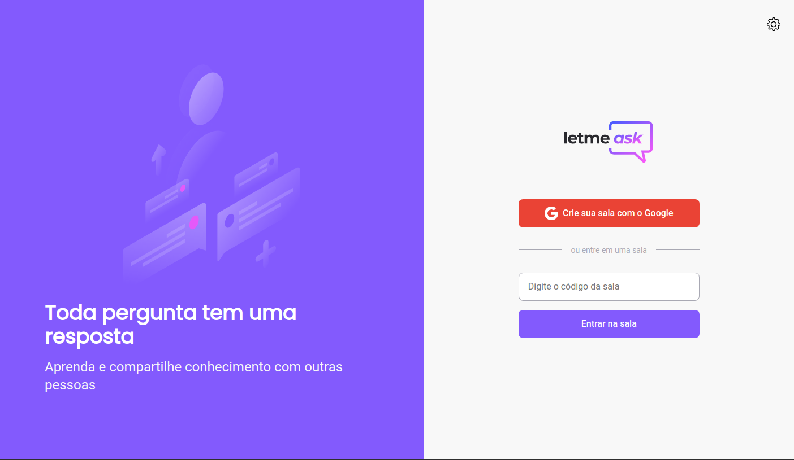
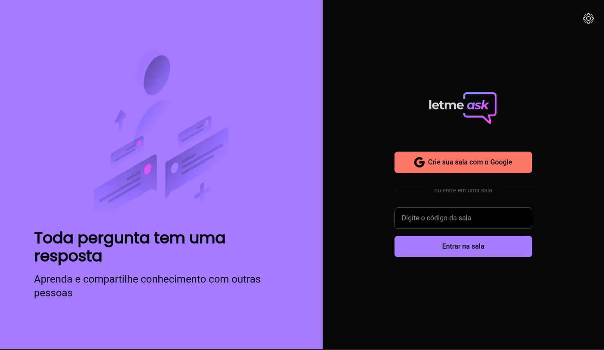

<p align="center">
  
</p>

<p align="center">
  

  

  
</p>

<h1 align="center">
  
</h1>

<br>

## 🧪 Tecnologias

Este projeto foi desenvolvido durante o evento de programação da [Rocketseat](https://rocketseat.com.br), o NLW Together 06. A aplicação desenvolvida utiliza as seguintes tecnologias:

- [React](https://reactjs.org)
- [Firebase](https://firebase.google.com/)
- [TypeScript](https://www.typescriptlang.org/)
- [React Hot Toast](https://react-hot-toast.com)

## 🚀 Como executar

Primeiramente clone o projeto e acesse a pasta do mesmo. Certifique-se de que tenha o [git](https://git-scm.com) instalado e configurado em seu computador ou notebook.

```bash
$ git clone https://github.com/alexandresantosm/letmeask.git
$ cd letmeask
```

Para iniciar o projeto, siga os passos abaixo:

```bash
# Instalar as dependências necessárias do projeto
$ yarn #ou
$ npm install

# Iniciar o projeto
$ yarn start #ou
$ npm start
```

O app estará disponível no seu browser pelo endereço http://localhost:3000.

Lembrando que será necessário ter uma conta no [Firebase](https://firebase.google.com/) e um projeto criado previamente para disponibilizar um Realtime Database.

## 💻 Projeto

Letmeask é perfeito para criadores de conteúdos poderem criar salas de Q&A com o seu público, de uma forma muito organizada e democrática.

Para os amantes de cores escuras, o projeto conta com um tema dark.

<h3 align="center">
  
</h3>

Além de possuir temas light e dark, o projeto conta com telas de modais, utilizando a bliblioteca [react-modal](https://github.com/reactjs/react-modal) e notificações personalizados, utilizando a biblioteca [react-hot-toast](https://react-hot-toast.com).

Este é um projeto desenvolvido durante a **[Next Level Week Together 06](https://nextlevelweek.com/)**, apresentada dos dias 20 a 27 de Junho de 2021.

## 🔖 Layout

Você pode visualizar o layout do projeto, disponibilizado pela [Rocketseat](https://rocketseat.com.br), através do link abaixo:

- [Layout Web](https://www.figma.com/file/u0BQK8rCf2KgzcukdRRCWh/Letmeask/duplicate)

Lembrando que você precisa ter uma conta no [Figma](http://figma.com/).

## 📝 License

Esse projeto está sob a licença MIT. Veja o arquivo [LICENSE](LICENSE.md) para mais detalhes.

---

Feito com 💜 by Alexandre 👋🏻
